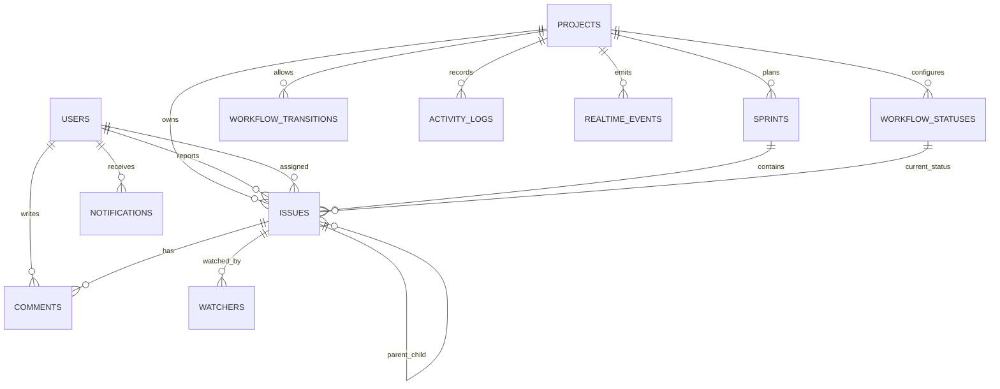
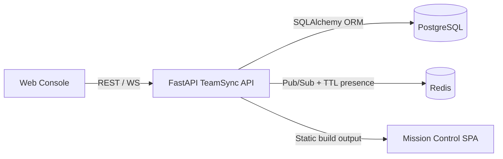
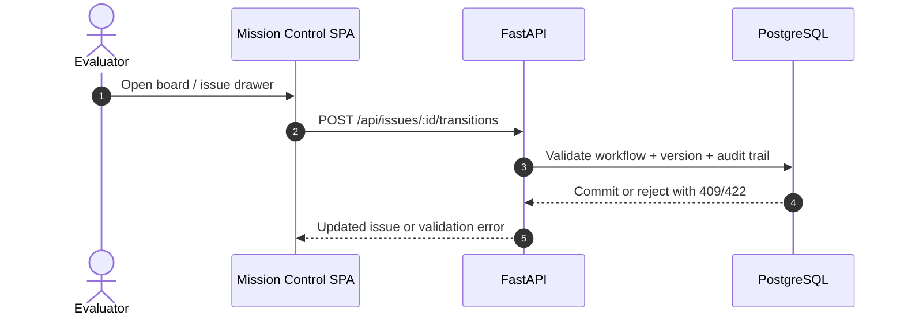

# TeamSync Backend

TeamSync is an original FastAPI backend for the SDE-1 project-management assignment. It implements Jira-like issue tracking, configurable workflows, sprints, collaboration, realtime project events, search, Docker setup, seed data, and Swagger docs.

`jira_clone_master/` was treated only as a read-only domain reference. No code, comments, structure, tests, or docs were copied from it.

## Submission Pack

- [Use case scenarios with screenshots](docs/USE_CASE_SCENARIOS.md)
- [Architecture notes and ERD](docs/ARCHITECTURE.md)
- [Assignment checklist and requirement map](docs/ASSIGNMENT_CHECKLIST.md)

## Quick Start

```powershell
python -m pip install -e ".[dev]"
python run.py
```

API:

- Base URL: `http://localhost:8000`
- Health: `http://localhost:8000/health`
- Swagger: `http://localhost:8000/docs`

Docker:

```powershell
Copy-Item .env.example .env
docker compose up --build
```

The committed `.env.example` contains safe local defaults. Do not commit `.env`. Docker Compose starts PostgreSQL, Redis, and the API; when `REDIS_URL` is unset or Redis is unreachable, realtime falls back to single-process in-memory coordination.

## Seeded Demo Data

When `SEED_DEMO_DATA=true`, startup creates:

- 3 users: `jane`, `bob`, `maya`
- 1 project: `TS`
- Statuses: Backlog, To Do, In Progress, In Review, Done
- Transitions: Backlog -> To Do -> In Progress -> In Review -> Done
- 2 sprints
- 6 issues: epic, 2 stories, task, bug, sub-task
- Comments, watchers, notifications, activity logs, and realtime events

Useful discovery endpoints:

```powershell
curl http://localhost:8000/api/users
curl http://localhost:8000/api/projects
curl http://localhost:8000/api/projects/TS/board
```

## Architecture

Routes are thin and delegate assignment behavior to services. SQLAlchemy models define the relational domain, Alembic owns migrations, and service transactions write issue mutations together with audit logs, notifications, and realtime events.



Key choices:

- Optimistic locking uses `issues.version`.
- Workflow transitions are data-driven in `workflow_transitions`.
- Activity logs are persisted for issue/project audit trails.
- Realtime events are persisted with monotonic integer IDs for missed-event replay.
- Realtime fanout and presence use Redis pub/sub plus TTL-backed presence when `REDIS_URL` is configured, with in-memory fallback for local runs.
- Search uses practical SQL `ILIKE` over issues and comments, with indexes documented in the schema.





## Scenario Walkthrough

See [docs/USE_CASE_SCENARIOS.md](docs/USE_CASE_SCENARIOS.md) for the step-by-step evaluator flow with screenshots:

- API health and board boot
- workflow violation handling
- optimistic locking conflict
- sprint completion with carry-over
- collaboration mention and notifications
- search and realtime replay

## API Overview

| Area | Endpoint | Status | Demo command | Notes |
| --- | --- | --- | --- | --- |
| Health | `GET /health` | Implemented | `curl http://localhost:8000/health` | Startup smoke check |
| Demo reads | `GET /api/projects`, `GET /api/users` | Implemented | `curl http://localhost:8000/api/projects` | Helps Swagger demos discover IDs |
| Issues | `POST /api/projects/{project_id}/issues` | Implemented | Use Swagger create issue body | Supports parent and custom field validation |
| Board | `GET /api/projects/{project_id}/board` | Implemented | `curl http://localhost:8000/api/projects/TS/board` | Groups issues by configured status |
| Issue update | `PATCH /api/issues/{issue_id}` | Implemented | Patch with `expected_version` | Returns 409 on stale versions |
| Workflow | `POST /api/issues/{issue_id}/transitions` | Implemented | Move `TS-4` to `Done` | Invalid moves return 422 with allowed transitions |
| Sprints | `GET/POST /api/projects/{project_id}/sprints` | Implemented | `curl http://localhost:8000/api/projects/TS/sprints` | Date range sprint CRUD |
| Sprint lifecycle | `POST /api/sprints/{sprint_id}/start`, `PATCH /api/sprints/{sprint_id}`, `POST /api/sprints/{sprint_id}/complete` | Implemented | Complete Sprint 1 in Swagger | Returns completed, incomplete, carried-over, velocity |
| Comments | `GET/POST /api/issues/{issue_id}/comments`, `PATCH/DELETE /api/comments/{comment_id}` | Implemented | Add `@jane` comment | Threaded comments and mentions |
| Activity | `GET /api/projects/{project_id}/activity` | Implemented | `curl ".../activity?action=issue_moved"` | Supports cursor, action, issue, actor filters |
| Watchers | `POST /api/issues/{issue_id}/watch`, `DELETE /api/issues/{issue_id}/watch` | Implemented | Watch an issue as `bob` | Database subscriptions |
| Notifications | `GET /api/notifications` | Implemented | `curl ".../notifications?user_id=jane"` | In-app notification records |
| Search | `GET /api/search?q=...` | Implemented | `curl ".../search?q=Carry&status=In%20Progress"` | Text and structured filters with cursor |
| Realtime | `WS /ws/projects/{project_id}?last_event_id=0&user_id=jane` | Implemented | Connect via WebSocket client | Replays persisted events and tracks presence; Redis coordinates multi-instance fanout when configured |

Most mutating demo endpoints accept `?user_id={user_id_or_username}` to identify the actor.

## Demo Flow

1. Open Swagger at `http://localhost:8000/docs`.
2. Call `GET /api/projects` and use project key `TS` or the returned UUID.
3. Call `GET /api/projects/TS/board` to inspect seeded issues and versions.
4. Try workflow violation:

```powershell
curl -X POST "http://localhost:8000/api/issues/TS-4/transitions?user_id=jane" `
  -H "Content-Type: application/json" `
  -d "{\"to_status\":\"Done\",\"expected_version\":1}"
```

Expected: HTTP 422 with `allowed_transitions`.

5. Perform a valid transition to `In Progress`.
6. Patch an issue with `expected_version`, then retry with the stale version to see HTTP 409.
7. Add a comment containing `@jane` and inspect `GET /api/notifications?user_id=jane`.
8. Complete Sprint 1 with selective carry-over into Sprint 2.
9. Use `/api/search?q=Carry&status=In Progress`.
10. Connect to the WebSocket with `last_event_id=0` to replay missed project events.

For a polished evaluator walkthrough with screenshots, use [docs/USE_CASE_SCENARIOS.md](docs/USE_CASE_SCENARIOS.md).

## Tests

```powershell
python -m pytest -q
```

Current coverage verifies:

- seed data and `/health`
- issue creation, update, and optimistic locking
- workflow violation and valid transition
- sprint completion, carry-over, and velocity
- comments, mentions, watchers, notifications, and search
- WebSocket replay
- optional Redis realtime coordination fallback

## Assignment Mapping

See [docs/ASSIGNMENT_CHECKLIST.md](docs/ASSIGNMENT_CHECKLIST.md) for requirement-by-requirement status.

## Trade-Offs

- Hosted deployment is not performed in this workspace because it requires user-owned hosting credentials.
- Search uses SQL `ILIKE`; production would use PostgreSQL `tsvector`/GIN or a dedicated search engine.
- Redis-backed realtime coordination is intentionally lightweight; persisted `realtime_events` remain the authoritative replay source after reconnects.
- Auth is simplified for backend evaluation with seeded users and explicit actor IDs.

## Integrity Note

- `jira_clone_master/` remains excluded from commits and was used only for domain vocabulary.
- `.env`, the assignment PDF, and local build/cache artifacts are ignored.
