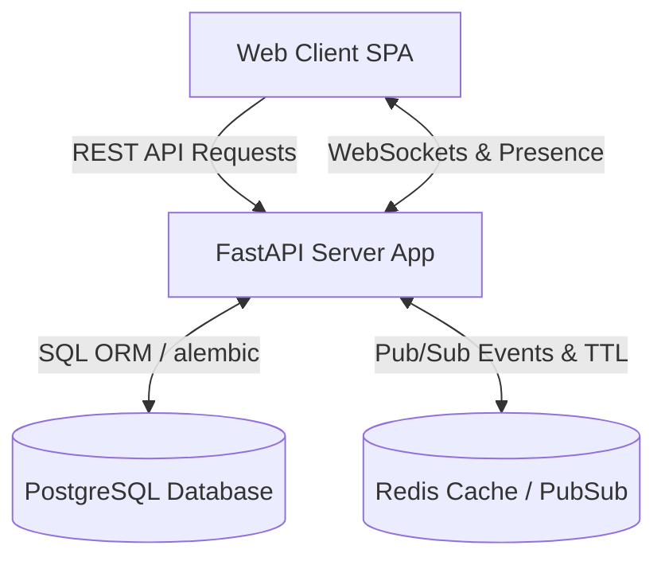
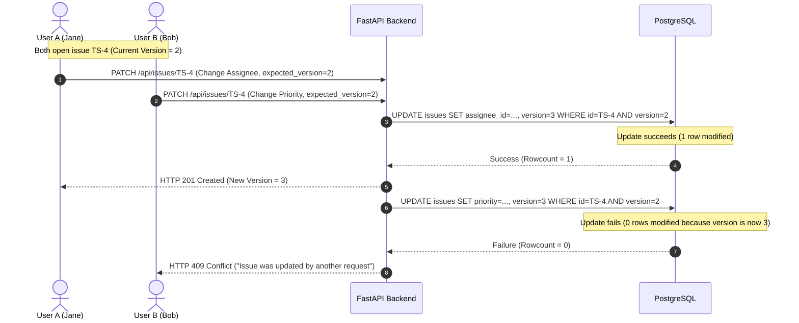
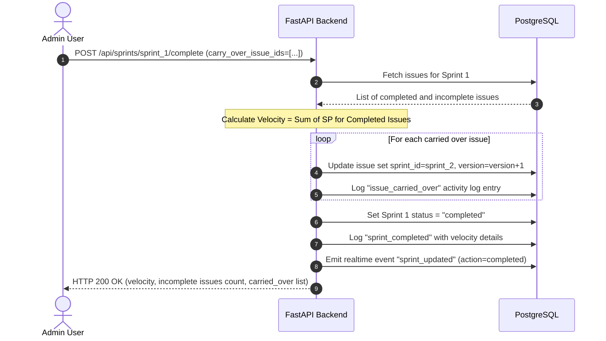
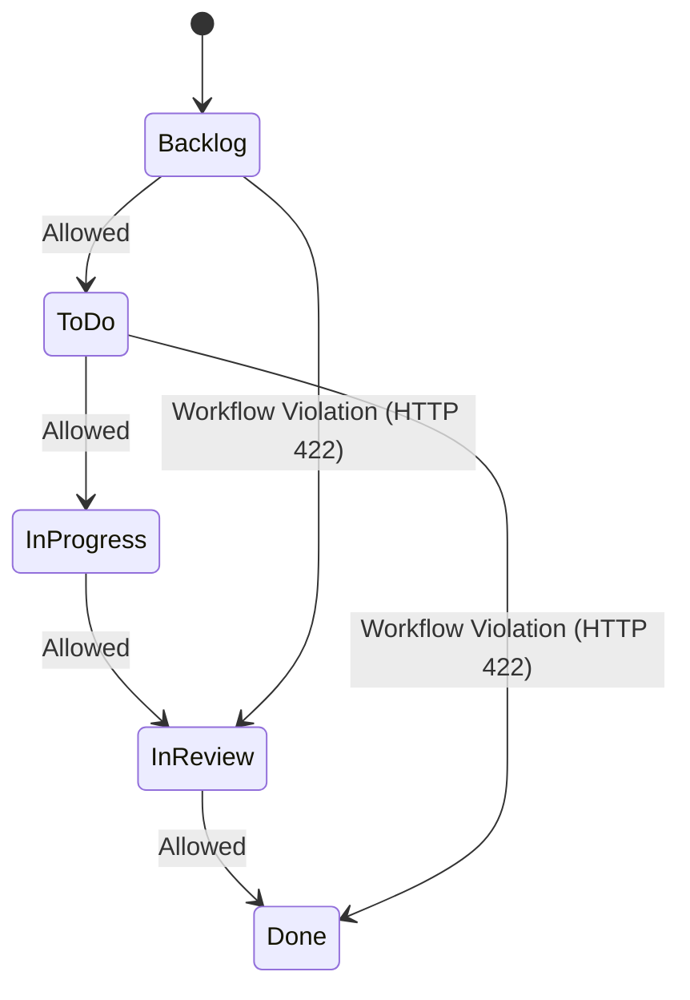

# TeamSync Platform: Technical Architecture & Submission Documentation

This document provides a comprehensive overview of the technical architecture, low-level design (LLD), key architectural rationale, and step-by-step verification of the three sample scenarios implemented for the **TeamSync Project Management Platform**.

---

## 1. System Overview

TeamSync is a collaborative, real-time project management console styled under the **Tokyo Light** theme, designed for agile engineering teams. It comprises:
* **Backend**: FastAPI web server, PostgreSQL database (SQLAlchemy ORM + Alembic migrations), and Redis (pub/sub and session presence tracking).
* **Frontend**: A custom vanilla TypeScript single-page application (SPA) built using Vite and TailwindCSS, communicating via REST APIs and WebSockets.



---

## 2. Low-Level Design (LLD) Diagrams

### A. Concurrent Issue Updates (Scenario 1)
Optimistic concurrency control is achieved using an incremental `version` field on the `Issue` model.



### B. Sprint Completion & Carry-Over (Scenario 2)
Sprint completion updates the sprint status, aggregates velocity from completed cards, and re-allocates incomplete cards.



### C. Workflow Transition & Validation (Scenario 3)
Transitions are strictly verified against the configured workflow path definitions.



---

## 3. Key Architectural Choices & Rationale

1. **Optimistic Concurrency Control**
   * *Choice*: Version column check during update query updates: `UPDATE issues SET ... version = version + 1 WHERE id = :id AND version = :expected_version`.
   * *Rationale*: Avoids heavy database write locks. Ensures that if another process changed the issue during the request lifespan, the update fails cleanly, and the client receives a version mismatch conflict.

2. **Data-Driven Workflow Engine**
   * *Choice*: Define transitions in a `workflow_transitions` join table connecting `workflow_statuses`.
   * *Rationale*: Allows easy adaptation to changes in status flow configurations without code refactoring.

3. **Monotonic Real-time Replay**
   * *Choice*: Persist events with monotonically increasing auto-increment IDs (`realtime_events`). WebSockets connect using a `last_event_id` query parameter.
   * *Rationale*: When clients lose connection (e.g., cell network drop), they connect back passing their last received event ID and replay all missed events in-order.

4. **Redis-Backed Telemetry Fanout**
   * *Choice*: Multi-instance coordination uses Redis Pub/Sub. Presence list is maintained in Redis keys with short TTLs.
   * *Rationale*: Scales to multiple active container instances. If Redis is unreachable, fallback in-memory pub/sub handles standalone single-node deployments gracefully.

---

## 4. Verification Scenarios & Screenshots

### Scenario 1: Concurrent Issue Updates
* **Action**: User B (Bob) updated the description of issue `TS-4` in the background (which successfully committed and incremented the version to `3`). When User A (Jane) tried to save her changes from the drawer using the outdated version (`2`), the backend rejected the update with a `409 Conflict`.
* **Result**: The UI successfully caught the error, displayed a warning toast, and reloaded the latest state to prevent overwriting Bob's update.


---

### Scenario 2: Sprint Completion with Carry-Over
* **Action**: Admin completed `Sprint 1`, which had 5 incomplete issues representing `13` story points, selecting `Sprint 2` as the carry-over target.
* **Result**:
  - The incomplete issues were moved to `Sprint 2` with an audit log track (`issue carried_over by jane`).
  - Sprint 1 transitioned to "Completed" with its final velocity calculated and recorded.

* **Carry-Over Selection Modal**:


* **Completed Sprint History**:


---

### Scenario 3: Workflow Violation
* **Action**: User dragged card `TS-5` (To Do) directly to the `Done` column.
* **Result**: The API blocked the operation, returning a `422 Unprocessable Entity` containing a `workflow_violation` code and the list of allowed moves (`[In Progress]`). The UI intercepted this response and rendered a red warning toast indicating the violation and allowed states.


---

## 5. Development & Deployment Guide

### Quick Start
1. Setup environment variables:
   ```bash
   cp .env.example .env
   ```
2. Start the services using Docker:
   ```bash
   docker compose up --build -d
   ```
3. Run test cases:
   ```bash
   docker compose exec api pytest
   ```
