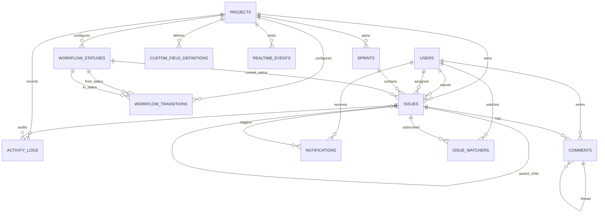

# TeamSync Architecture Plan

This document is a planning artifact for an original TeamSync backend implementation. It is based on the assignment text and repo-local skills, not on copied reference implementation details.

## Target Stack

- FastAPI for REST and WebSocket APIs.
- PostgreSQL for relational persistence.
- SQLAlchemy ORM for models and transactions.
- Alembic for migrations.
- Pydantic for request and response schemas.
- Pytest for service/API verification.
- Docker Compose for local PostgreSQL and API startup.

## Module Layout

Recommended application layout:

```text
app/
  main.py
  api/
    routes_projects.py
    routes_issues.py
    routes_sprints.py
    routes_comments.py
    routes_activity.py
    routes_search.py
    routes_realtime.py
  core/
    config.py
    errors.py
    pagination.py
  db/
    session.py
    base.py
  models/
    project.py
    user.py
    issue.py
    sprint.py
    workflow.py
    comment.py
    activity.py
    notification.py
    realtime.py
  schemas/
    project.py
    issue.py
    sprint.py
    comment.py
    activity.py
    search.py
    realtime.py
  services/
    issue_service.py
    workflow_service.py
    sprint_service.py
    comment_service.py
    activity_service.py
    notification_service.py
    search_service.py
    realtime_service.py
  repositories/
    issues.py
    sprints.py
    activity.py
```

Routes should stay thin. Validation, workflow decisions, audit logging, notifications, and realtime event writes belong in services. Repositories can hold repeated query shapes and pagination helpers.

## Core Data Model

Primary tables:

- `projects`: project/workspace container.
- `users`: assignment demo users.
- `issues`: issue records with type, status, assignee, reporter, parent, sprint, priority, story points, custom field values, and `version`.
- `sprints`: project-bound sprint lifecycle with start/end dates and active/completed state.
- `workflow_statuses`: configurable project status columns.
- `workflow_transitions`: allowed status movement rules per project.
- `custom_field_definitions`: project field definitions with type, required flag, and dropdown options.
- `comments`: issue comments with optional `parent_comment_id`.
- `activity_logs`: immutable audit entries for issue and project activity.
- `notifications`: persisted assignment, mention, and status-change notifications.
- `issue_watchers`: issue subscription records.
- `realtime_events`: durable project event stream for missed-event replay.

Recommended issue constraints:

- `issue_type` enum: `epic`, `story`, `task`, `bug`, `sub_task`.
- Parent hierarchy validation in service:
  - Story parent can be Epic.
  - Sub-task parent can be Story or Task, depending on chosen local rule.
  - Epic has no parent.
- `version` increments on every issue mutation.
- Sprint assignment is nullable for backlog items.
- Custom field values can start as JSONB keyed by field definition id/name, with service validation.

## ERD Draft



## Request Flow

### Issue Creation

1. Route receives project id, actor id, issue fields, optional parent, optional custom fields.
2. Service validates project, issue type, parent hierarchy, workflow default status, and custom field values.
3. Database transaction inserts issue, activity log, watcher side effects if needed, and realtime event `issue_created`.
4. WebSocket manager broadcasts the event after commit.
5. Response returns issue details and current `version`.

### Issue Update

1. Route receives issue patch and optional expected `version`.
2. Service loads the issue for update and rejects stale versions with HTTP 409.
3. Service applies allowed field changes, validates hierarchy/custom fields, increments `version`.
4. Transaction writes activity log, notifications for assignment/status side effects, and realtime event `issue_updated`.

### Workflow Transition

1. Route receives target status and actor id.
2. Workflow service checks configured `workflow_transitions`.
3. Invalid transition returns HTTP 422 with allowed target statuses.
4. Validation hooks run before mutation, including required fields.
5. Automatic actions run in the same transaction, such as reviewer/notification creation for In Review.
6. Issue status changes, `version` increments, activity log is written, realtime event `issue_moved` is persisted and broadcast.

### Sprint Completion

1. Sprint service loads sprint and selected carry-over issue ids.
2. Completed issues are separated from incomplete issues by Done/status category.
3. Velocity is calculated from completed story points.
4. Incomplete selected issues are moved to the selected carry-over sprint or backlog.
5. Sprint is marked completed in one transaction.
6. Activity and realtime `sprint_updated` event are written.

## WebSocket Design

Endpoint:

- `WS /ws/projects/{project_id}?last_event_id={optional}`

Behavior:

- On connect, validate project and register presence.
- If `last_event_id` is supplied, replay `realtime_events` for the project with greater ids.
- Broadcast persisted event payloads for:
  - `issue_created`
  - `issue_updated`
  - `issue_moved`
  - `comment_added`
  - `sprint_updated`
- When `REDIS_URL` is configured and reachable, broadcasts publish to Redis pub/sub and presence is stored with TTL-backed Redis keys for multi-instance coordination.
- When Redis is absent or unreachable, the manager falls back to local in-memory connections and presence.
- Persisted `realtime_events` remain the authoritative replay source; Redis is only a live coordination layer.

## Search Design

MVP endpoint:

- `GET /api/search?q=&project_id=&status=&assignee_id=&priority=&issue_type=&sprint_id=&cursor=&limit=`

MVP strategy:

- Join issues with comments only when text query is present.
- Use PostgreSQL `ILIKE` against title, description, and comment body for practical local evaluation.
- Apply structured filters before pagination.
- Use stable cursor pagination by `(updated_at, id)` or `(id)` depending on implementation simplicity.

Production indexing notes for README:

- Add B-tree indexes for project, status, assignee, priority, sprint, and updated/id pagination.
- Add `tsvector` generated/search column with GIN index for full-text ranking.
- Consider external search only when product needs advanced relevance, highlighting, or cross-workspace analytics.

## Transaction Boundaries

Use one database transaction for each multi-write business action:

- Issue create/update plus activity log, notifications, watcher changes, and realtime event.
- Workflow transition plus validation side effects, activity log, notifications, and realtime event.
- Comment create plus mention notifications, activity log, and realtime event.
- Sprint start/complete plus issue movement, velocity summary, activity log, and realtime event.

Broadcast WebSocket messages only after commit so clients do not observe rolled-back changes.

## README Coverage Notes

README should be added or updated by a later agent with these sections:

- What TeamSync is: original Jira-like project management backend for the assignment.
- Assignment mapping: table that links each requirement area to implemented files/endpoints/tests.
- Quick start: Docker Compose, migrations, seed data, API base URL, Swagger URL.
- Architecture: routes, services, repositories, models, database, realtime flow.
- ERD: include the Mermaid ERD from this document or a rendered equivalent.
- API overview: required endpoints and sample curl commands.
- Demo walkthrough:
  - create issue
  - load board
  - attempt invalid transition and show 422 allowed transitions
  - perform valid transition
  - add threaded comment with mention
  - complete sprint with carry-over
  - search issues
  - connect WebSocket and replay missed events
- Testing: exact pytest command and critical scenario coverage.
- Scale/trade-offs: optimistic locking, cursor pagination, indexes, WebSocket fanout, practical search, local notifications.
- Integrity: no code copied from `jira_clone_master`; assignment text is the source of truth.

## Open Implementation Decisions

- Authentication is not required by the extracted assignment text; MVP can use explicit `actor_id` fields and seeded users, documented as a backend-assignment simplification.
- Velocity should default to sum of completed story points; if story points are absent, use zero and document the assumption.
- Required-field validation hooks should start with custom field required flags and Done/In Review rules.
- Presence should use Redis TTL storage when configured and explicitly document the in-memory fallback for local single-process runs.
- Hosted demo remains a separate delivery step because deployment target and budget are not specified.
