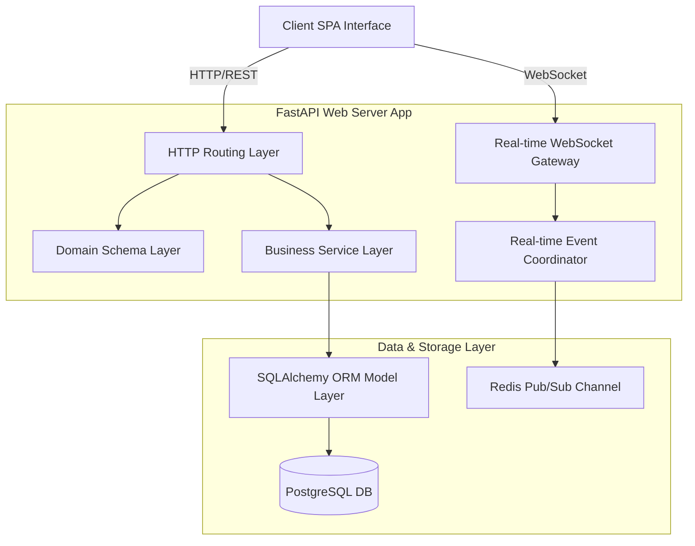

# Technical Architect Code Audit: Modularity & Maintainability

This audit assesses the code architecture, modular design, and maintainability of the **TeamSync** platform from the perspective of a Technical Architect.

---

## 1. Modularity Analysis

Modularity defines how cleanly a system is decomposed into independent, interchangeable modules. TeamSync adheres to a highly decoupled **Three-Tier Architecture Layering** pattern.

### Key Modularity Highlights:
1. **Separation of Concerns (SoC)**:
   * **API / Presentation Layer (`app/routes.py`)**: Thin endpoints. Their responsibility is strictly limited to handling HTTP requests, query parameters, dependency injections (database session, active user), and schema validations. No business logic lives here.
   * **Business Logic Layer (`app/services.py`)**: The engine of the application. It runs all validations (hierarchy checks, sprint status, transition verification) and modifies the database.
   * **Domain Model Layer (`app/models.py`)**: Declarative SQLAlchemy models containing clean relationships and database indices.
   * **Schema Layer (`app/schemas.py`)**: Pydantic schemas validating input/output payloads at application boundaries.

2. **Isolated Event-Driven Telemetry (`app/realtime.py`)**:
   * Encapsulates socket connection state, subscriber mapping, Redis Pub/Sub channels, and in-memory event channels. The rest of the application remains unaware of the transport layer; they simply push standard payloads via `services.py` triggers.

3. **Decoupled Configuration Management (`app/config.py`)**:
   * Uses `pydantic-settings` to load configuration from environment variables with fallback values. This keeps operational configurations outside of source files, facilitating secure cloud runs.

---

## 2. Maintainability Analysis

Maintainability refers to the ease with which code can be understood, corrected, adapted, and extended.

### Key Maintainability Highlights:
1. **Type Safety and Input Validation**:
   * Strict Python type hinting is used across services and helper functions. Input payloads are immediately parsed and validated by Pydantic models in routes. This eliminates common run-time bugs such as `KeyError` or unexpected types.

2. **Idempotence & Seeding Resilience**:
   * The seeding script in `app/seed.py` is fully resilient: if databases have existing table entries from previous builds, the script verifies if dependent tables (like project memberships) are missing and inserts them safely. This ensures consistency on fresh restarts.

3. **Optimistic Locking for Race-Condition Integrity**:
   * Concurrency is handled atomically at the DB query level using atomic filter states. It raises version conflict errors before commits, keeping the application state consistent without database deadlock risks.

4. **Monotonic Real-time Replays**:
   * Instead of maintaining stateful RAM arrays for client connection catch-ups, the WebSocket endpoint relies on persisted event logs (`RealtimeEvent`). Reconnection replays execute as standard database index scans, ensuring predictable RAM usage over time.

5. **Alembic Migration Track**:
   * Fully automated version histories under `alembic/versions` allow quick database rollbacks and updates, matching professional CI/CD standards.

---

## 3. Recommended Architectural Evolutions

For large-scale enterprise production environments, we suggest the following modifications:
1. **CQRS Pattern**: Separate Read (Query) and Write (Command) service operations to allow scaling of read replicas as query traffic scales.
2. **Dedicated Search Indexing**: Replace the SQL `ILIKE` search query with a dedicated search store (e.g. Elasticsearch or OpenSearch) for large issue bodies.
3. **JWT / OIDC Integration**: Replace developer headers (`X-Dev-Token`) with JWT signature verification middleware using standard OAuth2 authentication.
