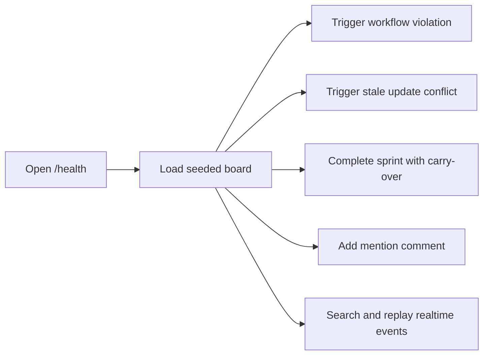
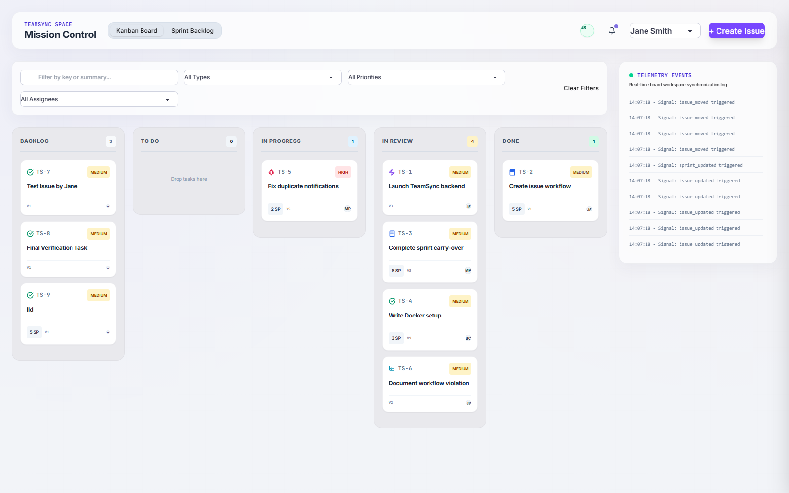
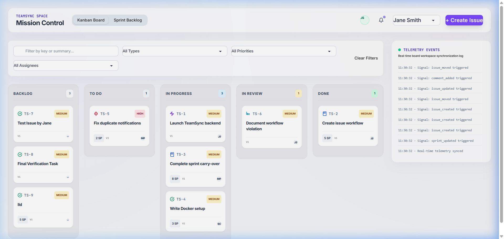
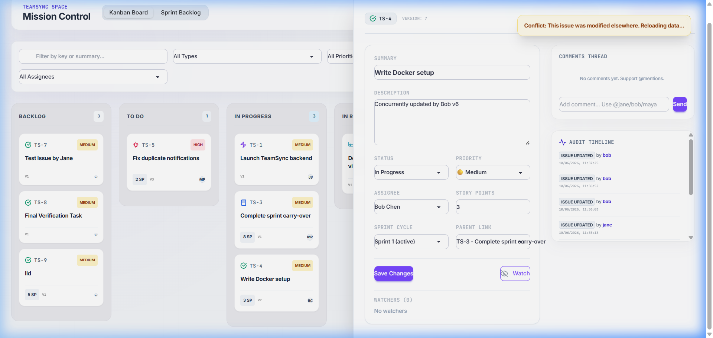
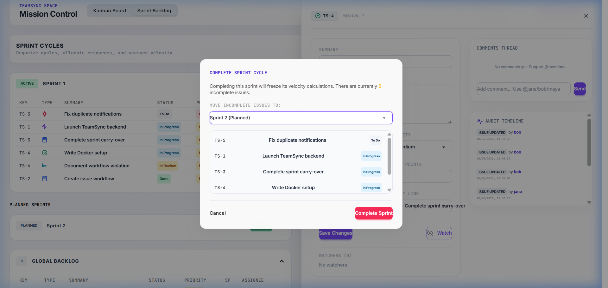
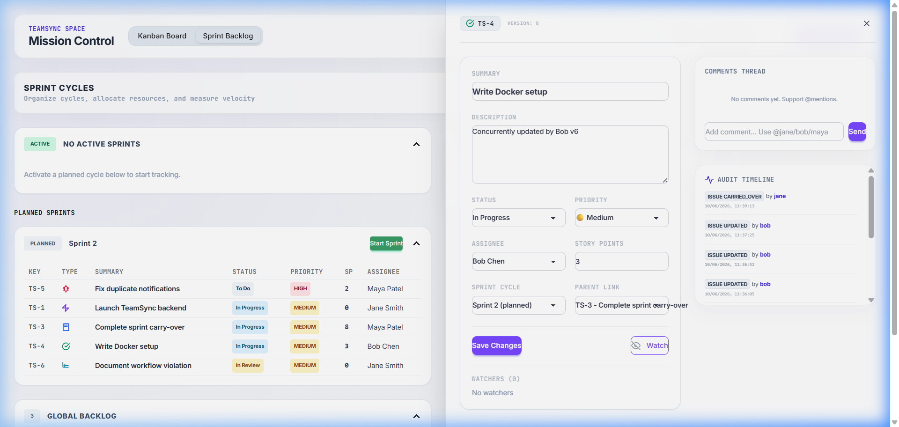
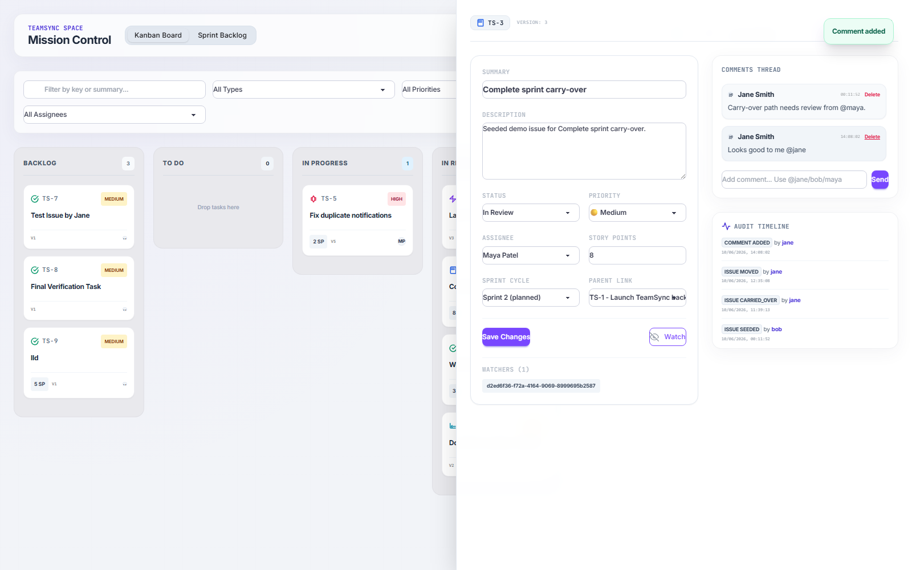

# TeamSync Use Case Scenarios

This document is the evaluator-facing walkthrough for the assignment scenarios that TeamSync covers. It is intentionally short, step-by-step, and linked to screenshots captured from the running app.

Screenshot assets live in [docs/assets](assets/).

## Demo Flow

## Scenario 1: Board And API Health

Goal: prove the app boots cleanly, seeds data, and exposes the board.

Steps:
1. Open `http://localhost:8000/health`.
2. Confirm the response is `{"status":"ok","service":"teamsync"}`.
3. Open `http://localhost:8000/`.
4. Confirm the seeded project loads with the five workflow columns.

Evidence:

Expected result:
- `TeamSync Platform` is visible.
- The seeded project board renders with `Backlog`, `To Do`, `In Progress`, `In Review`, and `Done`.
- Telemetry shows the app connected and replayed the initial events.

## Scenario 2: Workflow Violation

Goal: demonstrate the assignment requirement that invalid transitions return HTTP 422 and list allowed transitions.

Steps:
1. Open an issue in `To Do`, such as `TS-5`.
2. Open the issue drawer.
3. Change the status to `Done`.
4. Click `Save Changes`.
5. Confirm the app shows an error toast and the issue stays in the original valid status.

Evidence:

Expected result:
- The API rejects the move with `422`.
- The payload includes `workflow_violation` and `allowed_transitions`.
- The board does not accept the invalid move.

## Scenario 3: Concurrent Issue Update Conflict

Goal: show optimistic locking works and stale saves are rejected with HTTP 409.

Steps:
1. Open `TS-4` in the drawer.
2. Simulate a second actor updating the same issue first.
3. Save the stale copy from the drawer.
4. Confirm the app warns about a version conflict and reloads the latest issue state.

Evidence:

Expected result:
- The backend returns `409 Conflict`.
- The drawer reloads the fresh version instead of overwriting newer data.

## Scenario 4: Sprint Completion With Carry-Over

Goal: demonstrate sprint closing, carry-over selection, and velocity reporting.

Steps:
1. Switch to `Sprint Backlog`.
2. Open the active sprint.
3. Click `Complete Sprint`.
4. Select the next sprint as the carry-over target.
5. Confirm completion.
6. Verify the sprint summary now shows completed, incomplete, carried-over, and velocity values.

Evidence:

Expected result:
- Completed items remain closed.
- Incomplete items are moved to the chosen sprint when requested.
- Velocity is returned deterministically.

## Scenario 5: Collaboration, Mentions, And Notifications

Goal: prove comment threading and mention notifications are wired through the API and UI.

Steps:
1. Open `TS-3` or another active issue.
2. Add a comment containing `@jane`.
3. Confirm the comment appears in the thread.
4. Open the notification area and confirm a mention notification is present.

Evidence:

Expected result:
- The comment is saved as a threaded comment.
- A mention notification is created for the referenced user.
- The audit timeline reflects the comment activity.

## Scenario 6: Search And Realtime Replay

Goal: show the assignment search path and the persisted realtime event log.

Steps:
1. Search for a known term such as `Carry`.
2. Filter by status or assignee.
3. Reopen the app or reconnect the websocket with `last_event_id=0`.
4. Verify the telemetry panel replays the persisted events and the board refreshes live.

Expected result:
- Search returns filtered issue rows.
- The websocket receives the persisted replay first and then live events.

## Evaluator Notes

- The repo keeps the scenario evidence in `docs/assets`.
- The main walkthrough and architecture references are linked from the README.
- The assignment checklist remains the requirement-by-requirement source of truth.
